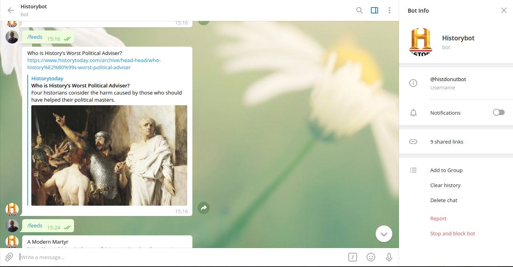

# Capstone-project-telegram-bot

# What it does
In this project, am building a History bot that provide the users with world's leading scholars, on all periods, regions and themes of history.

## Built With
- Ruby
- History.org RSS
- Telegram Bot API
#### and deployed to Github

## Installation
- Ensure you have a Telegram account, Ruby and RSpec installed

## Getting Started
* git clone https://github.com/DickensJuma/Capstone-project-telegram-bot.git 
* Run **gem install telegram-bot-ruby**
* Run **bundle install** -> to install the dependencies
* Run bin/main.rb -> to run the program
* Run **gem install rspec** -> to install rspec
* Run **rspec** -> to test the program with rspec

## How to interact with the bot on telegram
- Run the program on the editor: ruby bin/main.rb
- Search for the bot **@Historybot** on your telegram account and then type /start on the chat field to start the bot, type /feeds , /magazine and /reviews to get random information about cats and type /stop to end the bot as shown below:

## Author

👤 **Ritta Buyaki**

- Github: [@DickensJuma](https://github.com/DickensJuma)
- Twitter: [@juma_dickens](https://twitter.com/juma_dickens)
- Linkedin: [DickensJuma](https://www.linkedin.com/in/dickens-juma/)

## 🤝 Contributing

Feel free to check the [issues page](https://github.com/DickensJuma/Capstone-project-telegram-bot/issues).

## Attributions and Credit
Special thanks to Microverse!

History.org

## Show your support

Give a ⭐️ if you like this project!

## 📝 License

This project is licensed by Microverse.

### Enjoy!